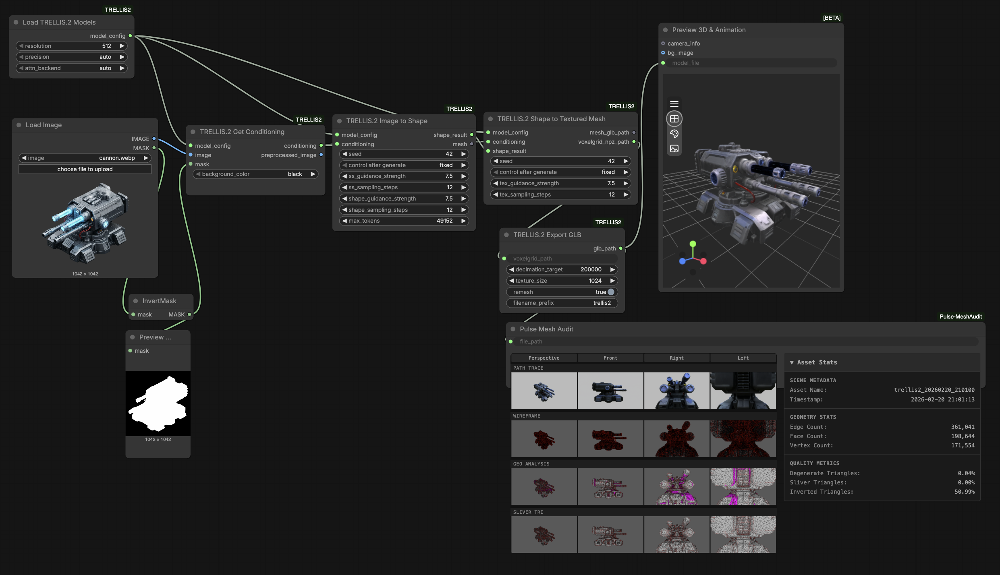
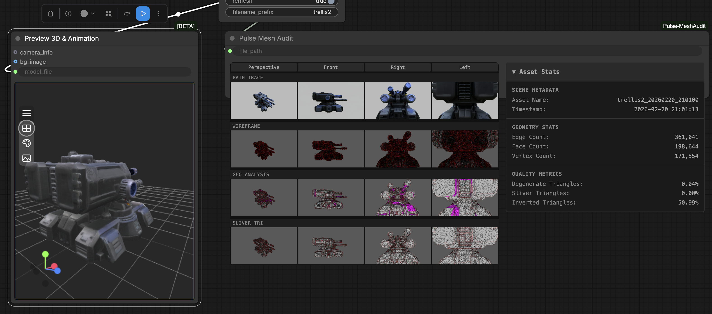
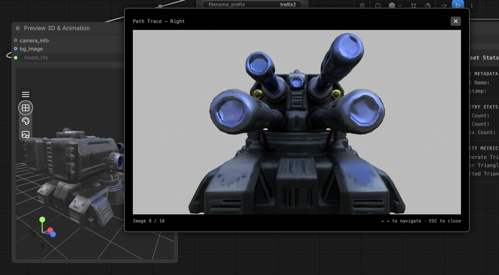
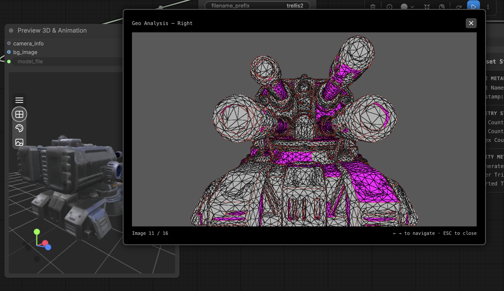

# ComfyUI Pulse MeshAudit

A ComfyUI custom node for auditing 3D mesh files by rendering them with a headless renderer and displaying an interactive carousel of renders with detailed mesh statistics.

## Features

✨ **16-Render Carousel**
- 4 camera angles (Perspective, Front, Right, Left)
- 4 shading modes (Path Trace, Wireframe, Geometry Analysis, Sliver Triangles)
- Auto-resizing grid layout with intuitive modal viewer

🖼️ **Interactive Image Viewer**
- Click any render to view fullscreen in centered modal
- Navigate with **← →** arrow keys to explore different views
- **ESC** key or **✕** button to close
- Image counter and label display

📊 **Asset Statistics Panel**
- Collapsible accordion with three categories:
  - **Scene Metadata**: Asset name, timestamp
  - **Geometry Stats**: Edge count, face count, vertex count
  - **Quality Metrics**: Degenerate/sliver/inverted triangle percentages
- Dark-themed UI matching carousel design
- Responsive layout that adapts to node size

🔍 **Pathtracer Integration**
- Uses bundled headless renderer binary
- Generates 16 PNG renders per execution (~14ms)

## Screenshots









## Installation

### Requirements

- **ComfyUI** (latest)
- **Linux x64** system (Windows WIP)
- **Python 3.8+**
- **~500MB** disk space for binary and assets

### Steps

1. **Clone into ComfyUI custom_nodes:**
```bash
cd /path/to/ComfyUI/custom_nodes
git clone https://github.com/yourusername/ComfyUI-Pulse-MeshAudit.git
cd ComfyUI-Pulse-MeshAudit
```

2. **Verify binary:**
```bash
ls -lh bin/linux-x64/agnirt
```

3. **Restart ComfyUI:**
```bash
# From ComfyUI root
python3 main.py
```

4. **Verify installation:**
   - In ComfyUI UI, search for "PulseMeshAudit" node
   - Node should appear in Pulse/MeshAudit category

## Usage

### Basic Workflow

1. **Add PulseMeshAudit node** to canvas
2. **Set file_path** to your mesh file:
   - Supported: `.glb`, `.obj`, `.gltf`
3. **Execute node** (Ctrl+Enter or click execute button)
4. **View renders**:
   - Hover over images for outline highlight
   - Click any image to view fullscreen
   - Use arrow keys to navigate between views
5. **Inspect stats**:
   - Click "Asset Stats" header to expand/collapse
   - View scene metadata, geometry counts, quality metrics

### Example Mesh Files

Test with assets/ArmoredWarrior_00005_.glb 
Example workflow file here : workflows/mesh_audit.json


## Contributing

Contributions welcome! Please:

1. Fork the repository
2. Create a feature branch: `git checkout -b feature/your-feature`
3. Commit changes: `git commit -m "feat: describe your change"`
4. Push to branch: `git push origin feature/your-feature`
5. Open a Pull Request

## License

**MIT License with Commons Clause**

Free for non-commercial use. Commercial use requires explicit written permission.

See [LICENSE](LICENSE) file for full details.


